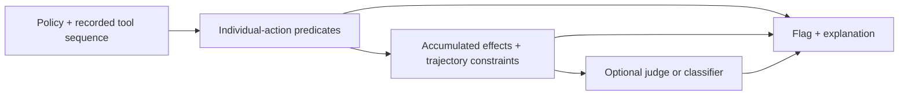

# TrajectoryShield

**Detect policy violations that emerge across a sequence of agent actions.**

An inspectable research prototype by [Muhammad Meeran](https://meeran.dev), developed through graduate research at Texas Tech University with Professor Akbar Namian.

**[Explore the interactive trace demo](https://meeran03.github.io/trajectoryshield/)** · [Research overview](docs/research-brief.md) · [Results and audit](docs/results.md) · [Implementation](trajectoryshield/trajectory_shield/shield.py)

A credential split across several writes can evade checks that inspect each write independently. TrajectoryShield combines individual-action predicates with accumulated file effects and trajectory/temporal policy checks. The repository includes the original research implementation, authored benchmark generators, optional model/classifier modules, and a reproducible offline release.

The paper is not part of this release. This is a research prototype; detections are heuristic policy signals, not proof of an agent's intent or a production security guarantee.

## Try it without an AI account

Python **3.11–3.13**. No model downloads or API calls for the default workflow.

```bash
git clone https://github.com/meeran03/trajectoryshield.git
cd trajectoryshield
python3 -m venv .venv
source .venv/bin/activate
pip install -e '.[test]'
trajectoryshield benchmark --output reports/local-run.json
trajectoryshield inspect examples/gold-cs001-comp-01.json
pytest -q
```

Preview the interactive demonstration locally:

```bash
python -m http.server 8000 --directory site
```

Open http://localhost:8000. The browser replays prefix decisions generated by the actual Python engine. It never executes the recorded tool calls. Regenerate its data with `PYTHONPATH=. python scripts/build_demo.py`.

## What is original here

- **A taxonomy of three trajectory patterns:** literal compliance, temporal evasion, and compositional obfuscation.
- **Layered evaluation:** step-level predicates, effect accumulation and temporal properties, plus optional judge/classifier modules.
- **An authored fixture suite:** 300 synthetic violating trajectories across five domains and seven policies.
- **Experiment infrastructure:** repository-implemented baselines, classifier preparation/training code, and archived aggregate results.
- **An explicit release audit:** duplicate model inputs across historical splits are counted and documented.



Layers short-circuit on a flag. The public demo and default benchmark use **Layers 1+2 only**. Optional Layer 3 modules are research code; their model runs and training have not been reproduced for this release.

## Reproduced public result

| Category | Detected / fixtures | Recall |
| --- | ---: | ---: |
| Literal compliance | 5 / 100 | 5.0% |
| Temporal evasion | 80 / 100 | 80.0% |
| Compositional obfuscation | 80 / 100 | 80.0% |
| **Total** | **165 / 300** | **55.0%** |

This is a **positive-only authored fixture set**. False-positive rate is undefined; these examples are not an independent evaluation set or a representative sample of deployed agents. [Every case verdict](reports/public-fixtures.json) is checked in. The demo also includes an encoded-value miss and a benign script that the broad heuristic flags.

## Historical results, with their limits

The working research corpus contained 2,041 trajectories. Saved aggregate outputs are available in [reports/archive](reports/archive), with source-file hashes. They are distinct from the public 300-fixture run.

The saved classifier result reports 310/310 correct binary decisions. The release audit found **14 distinct test inputs also in training, affecting 39 test rows**. That result must not be used as evidence of clean held-out generalization. New preparation groups identical serialized inputs before splitting; no corrected model evaluation is claimed. See [the full audit and remaining confounds](docs/results.md).

## Navigate the implementation

| Area | Entry point |
| --- | --- |
| Orchestration and layer verdicts | [shield.py](trajectoryshield/trajectory_shield/shield.py) |
| Accumulated effects | [effect_tracker.py](trajectoryshield/trajectory_shield/effect_tracker.py) |
| Policy specifications | [policy_specs.py](trajectoryshield/taxonomy/policy_specs.py) |
| Authored fixture generators | [gold_standard](trajectoryshield/benchmark/gold_standard) |
| Input grouping for future training | [splitting.py](trajectoryshield/splitting.py) |
| Optional classifier and training | [classifier.py](trajectoryshield/trajectory_shield/classifier.py) · [train_classifier.py](trajectoryshield/trajectory_shield/train_classifier.py) |
| Reproduction, dependencies, and exclusions | [Reproducibility](docs/reproducibility.md) |

The source was extracted into a fresh public history. Manuscripts, drafts, credentials, raw third-party patch datasets, model weights, and infrastructure scripts are excluded. Attribution and reuse status are described in [NOTICE.md](NOTICE.md).
